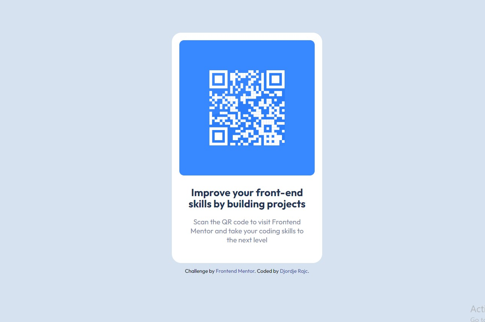

# Frontend Mentor - QR code component solution

This is a solution to the [QR code component challenge on Frontend Mentor](https://www.frontendmentor.io/challenges/qr-code-component-iux_sIO_H). Frontend Mentor challenges help you improve your coding skills by building realistic projects.

## Table of contents

- [Overview](#overview)
  - [Screenshot](#screenshot)
  - [Links](#links)
- [My process](#my-process)
  - [Built with](#built-with)
  - [What I learned](#what-i-learned)
  - [Continued development](#continued-development)
  - [Useful resources](#useful-resources)
- [Author](#author)

## Overview

### Screenshot



### Links

- Solution URL: [Add solution URL here](https://your-solution-url.com)
- Live Site URL: [Add live site URL here](https://your-live-site-url.com)

## My process

### Built with

- Semantic HTML5 markup
- CSS custom properties
- Flexbox
- SCSS

### What I learned

I have learned how to use CSS clip-path. I'm not very good at it so I'll try to learn it more.

```css
.imageClip {
  clip-path: rect(22% 78% 78% 22%);
}
```

### Continued development

I'll work on how to use other ways to manipulate images in CSS.

### Useful resources

- [Using clip-path](https://developer.mozilla.org/en-US/docs/Web/CSS/clip-path) - This source helped me understand clip-path property.

## Author

- Website - [Djordje Rajc](https://blurryface1998.github.io/Personal-Portfolio/)
- Frontend Mentor - [@Blurryface1998](https://www.frontendmentor.io/profile/Blurryface1998)
